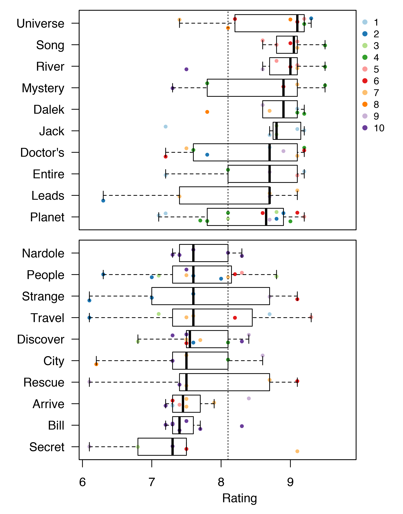

# eprate
Text mining of IMDB episode descriptions to look for associations with episode rating.

The scripts are written in Python 3, and depend on numpy, pandas, scikit-learn and the [IMDbPy](http://imdbpy.sourceforge.io) module.

For more details on the initial analysis, see [Predicting Doctor Who Episode Ratings](https://erle.io/blog/2018-03-05-predicting-imdb-episode-ratings/).


## Downloading Data

To download data, run the `gather_data.py` script. The script takes the name of the show as a command line argument.

```
$ python3 gather_data.py "Doctor Who"
Downloading data on Doctor Who
```

## Predicting on New Data

To predict the rating for a new episode description, use the `predict_rating.py` script. The prediction is made based on a gradient boosting machine with 100 iterations and a learning rate of 0.01.

```
$ python3 predict_rating.py "Doctor Who" "The Doctor adopts a baby Dalek"
[ 8.10292221]
```

## Benchmarking Models

The script `benchmark_models.py` can be used to assess the performance of different algorithms on predicting ratings for a particular show through [h2o](http://h2o.ai). The h2o leaderboard is printed to screen.

```
$ python3 benchmark_models.py "Doctor Who"
```


## Visualization

In addition to the main Python scripts, there is an R script `make_plots.R` for visualization. Examples of the output are shown below.

### Doctor Who
 


### The West Wing
 

### Game of Thrones

